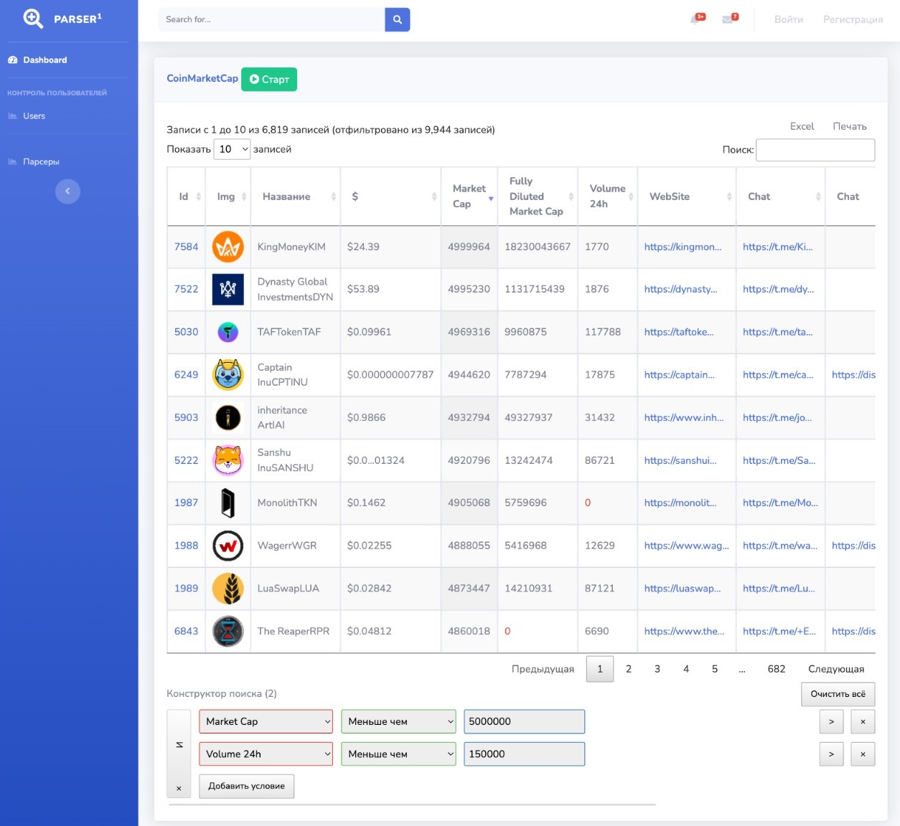
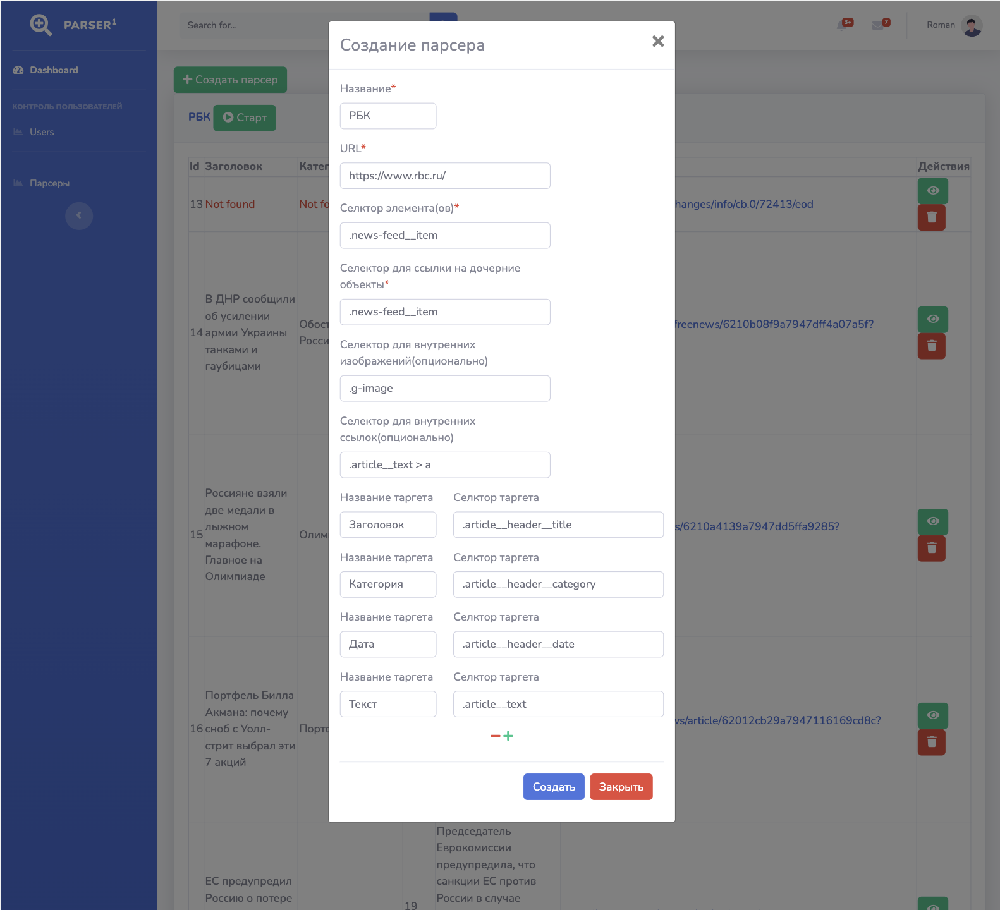
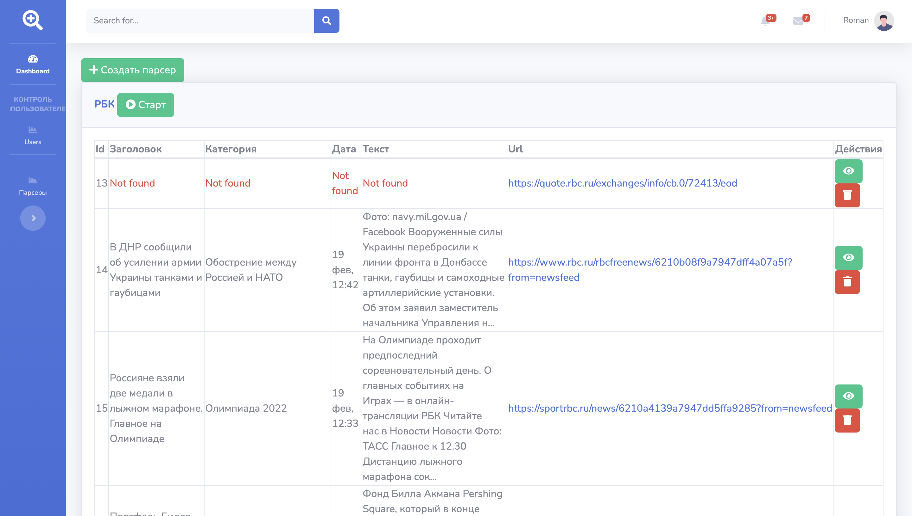
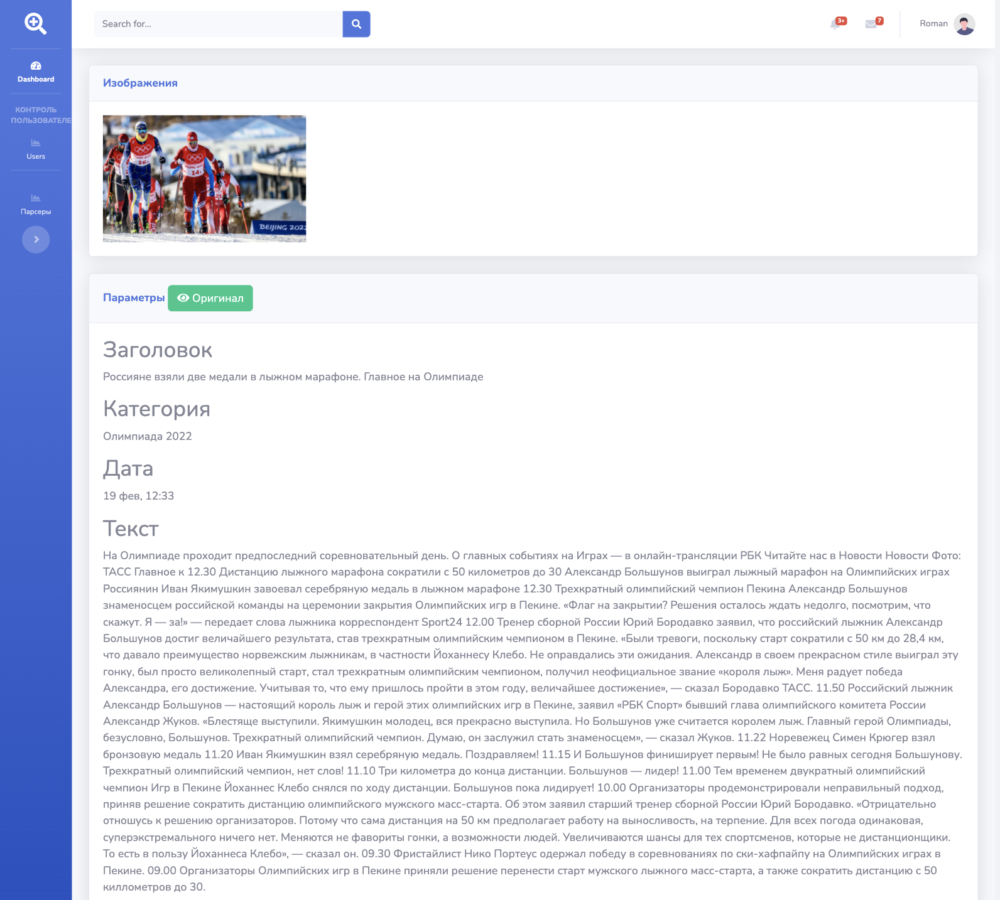

# Web Parser

Пользовательский Web прасер, с гиибкой системой 
создания и эксплуатации парсеров.

Возможные применения: 
 1. Парсинг новостей
 2. Парсинг криптовалютных площадок
 3. Парсинг информационных досок
 

### Основные файлы:
- Миграции (database/migrations).
- front-end (resources/js).
- Класс парсера (app/Utils/ParserUtil.php).
- Маршруты API (routes/api.php).

### ParserUtil
Можно реализовать обход защиты от парсинга путем унаследования и переопределения метода getHtml 

Так же реализовано управление Пользователями Авторизация/Регистрация

### Инструкция по запуску (необходим docker-compose)
    npm install //опционально (если нужно будет пересобирать проект)
    docker-compose build
    docker-compose up -d
    docker-compose exec fpm bash
    cd ../laravel-docker
    php artisan migrate
    
### Как можно улучшить
1. Привязать каждый парсер к пользователю если авторизировани (добавить nullable аттрибут user_id)
2. Добавить аттрибут is_public
3. Ввести разграничение прав доступа к парсером (пользователь видит только свои парсеры и те что is_public == true)
4. Расширить класс парсера добавив обход защиты от парсинга (подмена заголовков, Proxy, timeouts)
    
###Примеры
Создание парсера

Результаты парсинга

Страница результата парсинга

